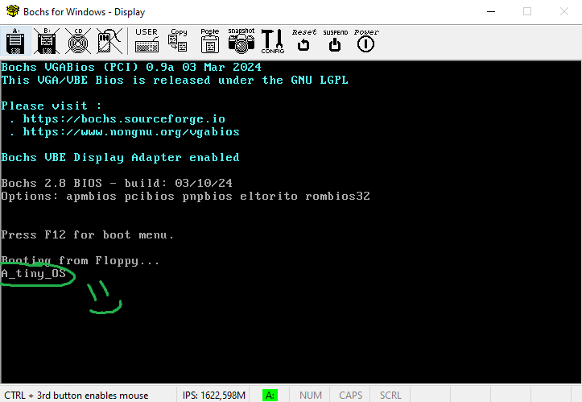

# a_tiny_os

Tiny Operating System from scratch
(yes, it only prints a message and hangs, not even bothering to clear the BIOS text, but it's a start!)


## Useful Links Used

- [Real Mode Assembly](https://wiki.osdev.org/Real_mode_assembly_I) at OSDev Wiki
- [OSDev](https://wiki.osdev.org/Main_Page) - OS Development Wiki
- [VGA text mode](https://en.wikipedia.org/wiki/VGA_text_mode) VGA Text Mode specification
- [Bochs](http://bochs.sourceforge.net/) - x86 Emulator
- [NASM](https://www.nasm.us/) - Netwide Assembler

## Build

```bash
nasm -f bin os.asm -o os.com
```

## Run on bochs

```bash
bochs -f bochsrc.txt
```
